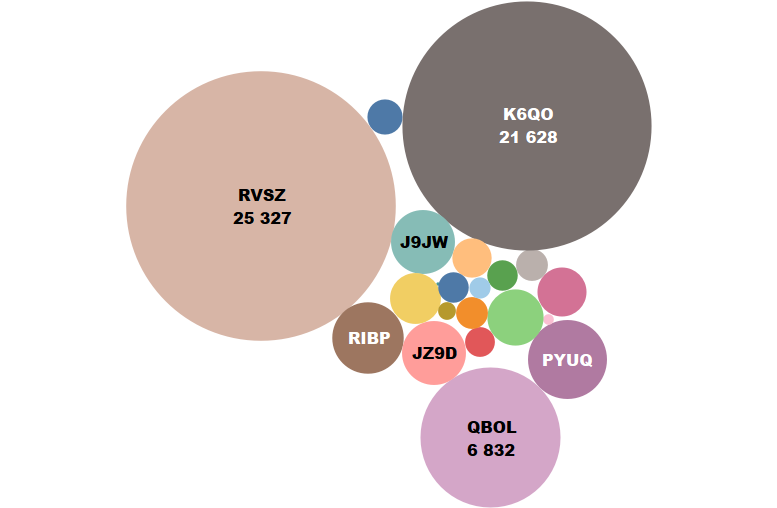

# Insurance_Recommendation
Proposer un modèle de Machine Learning capable de prédire le meilleur de produits d’assurance appropriés à recommander aux clients basés sur son profil actuel.

# Customers statistics

# Insurance products code suscribed per customers

# Machine Learning results with MultiLabel Classification (Logistic regression, Random forest and XGBOOST) in using binary relevant and classifier chain

